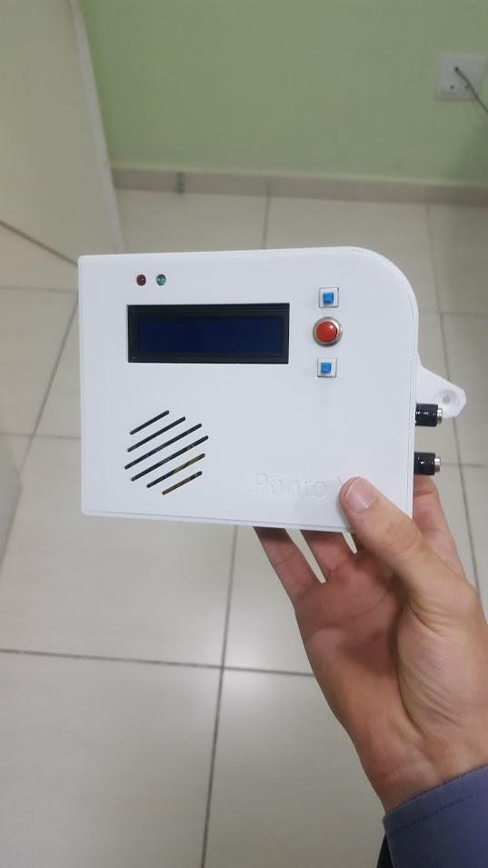
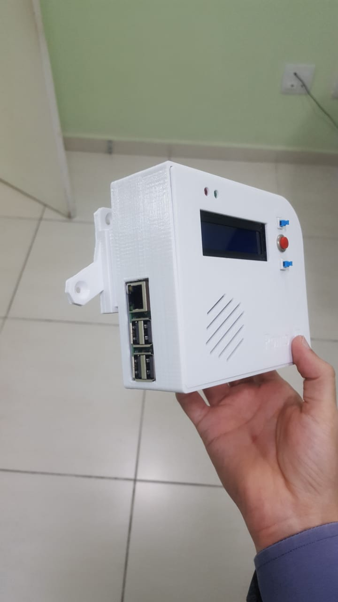

# README

## Português

Ponto de estagiários

Desenvolvido por Gabriel de Carvalho Souza

Agosto 2017 - Março 2018

### Informações

Projeto foi desenvolvido para substituir a escrita manual dos horários de entrada e saída dos estagiários da empresa. Para isso foi desenvolvido um sistema em NodeJS que com a utilização de um hardware (Raspberry PI e leitor de código de barras) que captava o código de barras dos crachas dos estagiários para realizar as marcações e um sistema de dashboard para o RH conseguir gerar relatórios. 

Imagens do harware

